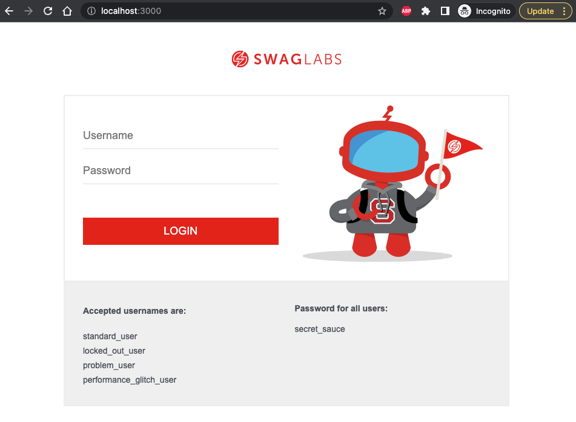
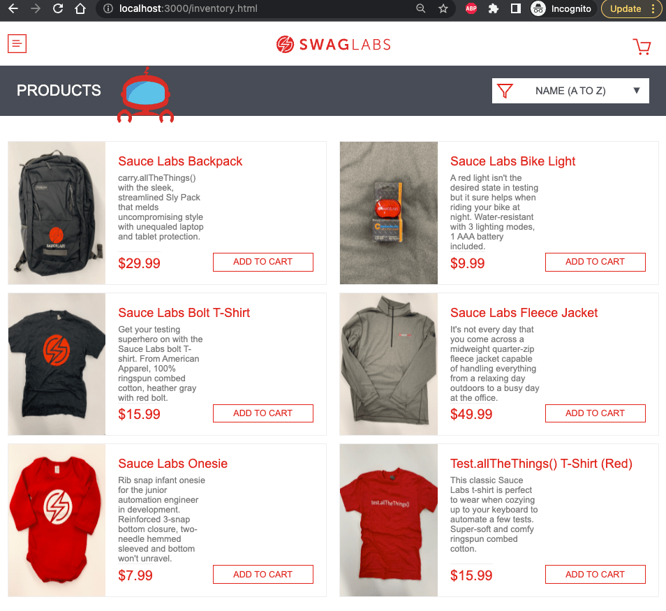

# taste-the-sauce

> Cypress testing tutorial using the SauceLabs sample web app





🎓 This is the example application for the course [Testing The Swag Store](https://cypress.tips/courses/swag-store).

## Install

Requires Node v16+

```
$ node -v
v16.17.0
$ npm install
```

## Run

To start the application location

```
$ npm start

Compiled successfully!

You can now view taste-the-sauce in the browser.

  Local:            http://localhost:3000
  On Your Network:  http://10.0.0.188:3000

Note that the development build is not optimized.
To create a production build, use npm run build.
```

Open the browser and point at `localhost:3000`, you should see the login page.

The original web application was forked from [saucelabs/sample-app-web](https://github.com/saucelabs/sample-app-web) repo.
